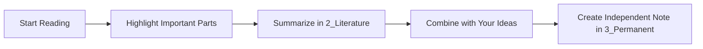
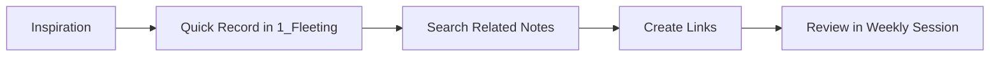

# Zettelkasten Quick Start Guide

> [!tip] Purpose of This Guide
> A practical guide to start using the Obsidian Zettelkasten system **effectively from today**

## 🚀 3 Steps to Start Right Now

### Step 1: Basic Setup (5 minutes)

#### Enable Required Plugins
1. **Settings** → **Community plugins** → **Browse**
2. Install and enable the following:
   - `Dataview` ✅
   - `Templates` ✅
   - `Obsidian Git` ✅ (Optional)

#### Configure Template Folder
1. **Settings** → **Templates** → **Template folder location**
2. Set to `Starter-Kit/Templates`

### Step 2: Create Your First Notes (10 minutes)

#### 🌱 Initial Fleeting Note
```markdown
# Today's Ideas - {{date}}

## Things I thought of
- 

## Things to research
- 

## Questions
- 

---
#type/fleeting 
```

#### 📚 Initial Literature Note (with a favorite book)
1. `Ctrl+N` → New note
2. `Ctrl+T` → Select template → `2_Book Template`
3. Fill in the properties

#### 💎 Initial Permanent Note (promoted from Fleeting)
1. Select a good idea from your fleeting notes
2. Use `3_Note Template`
3. Rewrite in your own words

### Step 3: Habit Formation Setup (5 minutes)

#### ⏰ Daily Routine Setup
```markdown
## Daily Zettelkasten Time (15 minutes)

### Morning (5 minutes)
- [ ] Review yesterday's fleeting notes
- [ ] Note materials to read today

### Evening (10 minutes)
- [ ] Record today's ideas in 1_Fleeting
- [ ] Promote valuable ideas to 3_Permanent
- [ ] Note tomorrow's learning plan
```

## 📝 Practical Workflows

### 📖 During Reading & Learning


**Example**:
1. **While Reading**: Note parts that make you think "Interesting!"
2. **Literature**: Book summary and key points from chapters
3. **Permanent**: Write "Why this idea is important" connecting it to your experience

### 💭 During Idea Generation


**Example**:
1. **Walking Inspiration**: Voice memo on phone → Transfer to Fleeting when home
2. **Related Search**: Type `[[idea]]` to find existing notes
3. **Link Creation**: Link related ideas with `[[]]`

## 🔗 Effective Link Creation Methods

### Pattern 1: Concept Development
```markdown
[[Basic Concept]] → [[Applied Idea]] → [[Practice Method]]
```

### Pattern 2: Contrast Structure
```markdown
[[Traditional Method]] ⚡ [[New Approach]]
```

### Pattern 3: Causal Relationship
```markdown
[[Cause]] → [[Effect]] → [[Solution]]
```

## 📊 First Week Checklist

### Day 1-2: Foundation
- [ ] Create 3 fleeting notes
- [ ] Create 1 literature note from a book
- [ ] Create 5 basic links

### Day 3-4: Expansion
- [ ] Create 2 permanent notes
- [ ] Add links between existing notes
- [ ] Set appropriate tags

### Day 5-7: Establishment
- [ ] Conduct weekly review
- [ ] Try Dataview queries
- [ ] Start personal customization

## 🎯 Common Beginner Mistakes and Solutions

### ❌ Mistake 1: Seeking Perfection
**Symptom**: Spending too long thinking before creating notes
**Solution**: "80% is OK" mindset. Can improve later

### ❌ Mistake 2: Not Creating Links
**Symptom**: Only isolated notes
**Solution**: Always create at least 2 links when making new notes

### ❌ Mistake 3: Neglecting Fleeting Notes
**Symptom**: 1_Fleeting accumulates without processing
**Solution**: Set dedicated review time twice a week

## 📈 Growth Milestones

### 🥉 Beginner Level (1 month)
- Note count: 50
- Link count: 100
- Daily habit: Stable

### 🥈 Intermediate Level (3 months)
- Note count: 200
- Knowledge clusters: 3-5
- Dataview usage: Basic

### 🥇 Advanced Level (6 months)
- Note count: 500
- Knowledge network: Densely connected
- System optimization: Complete

## 🛠️ Troubleshooting

### Problem: Don't know what to write
**Solutions**:
1. Start with thoughts on current reading
2. Record workplace learning
3. Begin with "Why?" and "How?" questions

### Problem: Can't think of links
**Solutions**:
1. Use `Ctrl+O` to search existing notes
2. Explore related notes through tags
3. Check visually with graph view

### Problem: Can't maintain consistency
**Solutions**:
1. Lower the bar (1 note per day)
2. Use voice memos on smartphone
3. Start with enjoyable topics

## 🎉 Mindset for Success

> [!quote] Niklas Luhmann
> "I write to think"

### Important Principles
1. **Quantity > Quality**: Prioritize quantity initially
2. **Consistency > Perfection**: A little bit daily
3. **Experiment > Theory**: Find your own way

### Maintaining Motivation
- Feel growth weekly
- Record new discoveries
- Share knowledge with others

---

> [!success] Start Now!
> An imperfect system started today is more valuable than a perfect system never begun.

**Next Actions**:
1. [ ] Create today's fleeting note
2. [ ] Commit to one week
3. [ ] Check [[Zettelkasten-Config-Guide-en]] for details 