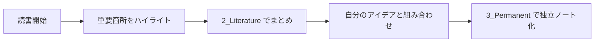
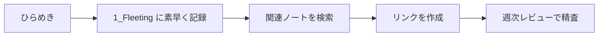

# Zettelkasten クイックスタートガイド

> [!tip] このガイドの目的
> Obsidian Zettelkastenシステムを**今日から**効果的に使い始めるための実践的なガイド

## 🚀 今すぐ始める3ステップ

### ステップ1: 基本設定（5分）

#### 必要なプラグインを有効化
1. **設定** → **コミュニティプラグイン** → **閲覧**
2. 以下をインストール・有効化：
   - `Dataview` ✅
   - `Templates` ✅
   - `Obsidian Git` ✅（オプション）

#### テンプレートフォルダ設定
1. **設定** → **Templates** → **Template folder location**
2. `Starter-Kit/Templates` を設定

### ステップ2: 最初のノート作成（10分）

#### 🌱 初回フリーティングノート
```markdown
# 今日のアイデア - {{date}}

## 思いついたこと
- 

## 調べたいこと
- 

## 疑問
- 

---
#type/fleeting 
```

#### 📚 初回文献ノート（お気に入りの本で）
1. `Ctrl+N` → 新規ノート
2. `Ctrl+T` → テンプレート選択 → `2_Book Template`
3. プロパティを埋める

#### 💎 初回永続ノート（フリーティングから昇格）
1. フリーティングノートの良いアイデアを選択
2. `3_Note Template` を使用
3. 自分の言葉で書き直し

### ステップ3: 習慣化設定（5分）

#### ⏰ 日次ルーチン設定
```markdown
## 毎日の Zettelkasten タイム（15分）

### 朝（5分）
- [ ] 昨日のフリーティングノートを確認
- [ ] 今日読む予定の資料をメモ

### 夜（10分）
- [ ] 今日のアイデアを 1_Fleeting に記録
- [ ] 価値あるアイデアを 3_Permanent に昇格
- [ ] 明日の学習計画をメモ
```

## 📝 実践的ワークフロー

### 📖 読書・学習時


**具体例**:
1. **読書中**: 「面白い！」と思った箇所をメモ
2. **Literature**: 本の要約とその章の重要ポイント
3. **Permanent**: 「なぜこのアイデアが重要なのか」を自分の経験と結びつけて記述

### 💭 アイデア発想時


**具体例**:
1. **散歩中のひらめき**: スマホで音声メモ → 帰宅後にFleetingへ
2. **関連検索**: `[[アイデア]]` と入力して既存ノートを探す
3. **リンク作成**: 関連するアイデアを `[[]]` でリンク

## 🔗 効果的なリンク作成法

### パターン1: 概念の発展
```markdown
[[基本概念]] → [[応用アイデア]] → [[実践方法]]
```

### パターン2: 対比構造
```markdown
[[伝統的手法]] ⚡ [[新しいアプローチ]]
```

### パターン3: 因果関係
```markdown
[[原因]] → [[結果]] → [[解決策]]
```

## 📊 最初の1週間チェックリスト

### Day 1-2: 基礎
- [ ] フリーティングノート 3つ作成
- [ ] 本のLiteratureノート 1つ作成
- [ ] 基本的なリンクを5つ作成

### Day 3-4: 展開
- [ ] Permanentノート 2つ作成
- [ ] 既存ノート間のリンクを追加
- [ ] タグを適切に設定

### Day 5-7: 定着
- [ ] 週次レビューを実施
- [ ] Dataviewクエリを試用
- [ ] 個人的なカスタマイズ開始

## 🎯 よくある初心者の間違いと対策

### ❌ 間違い1: 完璧を求めすぎる
**症状**: ノートを作成する前に長時間悩む
**対策**: 「80点でOK」マインドセット。後で改善可能

### ❌ 間違い2: リンクを作らない
**症状**: 孤立したノートばかり
**対策**: 新しいノート作成時に必ず2つ以上のリンクを作る

### ❌ 間違い3: フリーティングを放置
**症状**: 1_Fleetingが溜まりっぱなし
**対策**: 週に2回は必ず整理タイムを設ける

## 📈 成長のマイルストーン

### 🥉 初心者レベル（1ヶ月）
- ノート数: 50個
- リンク数: 100個
- 日次習慣: 安定

### 🥈 中級レベル（3ヶ月）
- ノート数: 200個
- 知識クラスター: 3-5個
- Dataview活用: 基本

### 🥇 上級レベル（6ヶ月）
- ノート数: 500個
- 知識ネットワーク: 密結合
- システム最適化: 完了

## 🛠️ トラブルシューティング

### 問題: 何を書けばいいかわからない
**解決策**:
1. 今読んでいる本の感想から開始
2. 仕事での学びを記録
3. 「なぜ？」「どうやって？」の質問から出発

### 問題: リンクが思いつかない
**解決策**:
1. `Ctrl+O` で既存ノートを検索
2. タグから関連ノートを探索
3. グラフビューで視覚的に確認

### 問題: 継続できない
**解決策**:
1. ハードルを下げる（1日1ノート）
2. スマホでの音声メモを活用
3. 楽しめるトピックから開始

## 🎉 成功のための心構え

> [!quote] Niklas Luhmann
> 「私は考えるために書く」

### 重要な原則
1. **量 > 質**: 最初は量を重視
2. **継続 > 完璧**: 毎日少しずつ
3. **実験 > 理論**: 自分なりのやり方を見つける

### モチベーション維持
- 週次で成長を実感
- 新しい発見を記録
- 他者との知識共有

---

> [!success] 今すぐ始めよう！
> 完璧なシステムよりも、今日始める不完璧なシステムの方が価値があります。

**次のアクション**:
1. [ ] 今日のフリーティングノートを作成
2. [ ] 1週間継続の宣言
3. [ ] [[Zettelkasten構成ガイド.md]] で詳細確認 